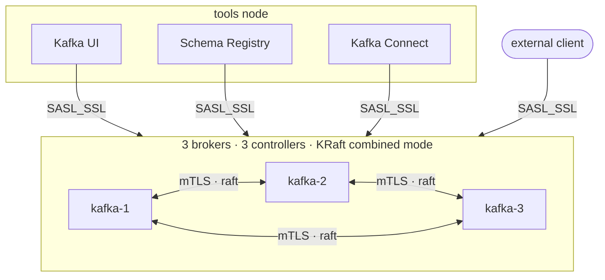

# kafka-kraft-ansible

[](https://github.com/bedrancans/kafka-kraft-ansible/actions/workflows/ci.yml)
[](LICENSE)

A three-broker **Apache Kafka cluster in KRaft mode, deployed with Ansible** —
with TLS, SASL/SCRAM and ACLs, and a layout that lets you add Kafka UI, Schema
Registry and Kafka Connect *without taking the cluster down*.

🇹🇷 [Türkçe README](README.tr.md)

Every push builds a four-node cluster from scratch, runs the same `site.yml`
an operator would run, converges it twice, and fails if the second pass
changes anything.



## Why this repo

Most Kafka examples show a one-shot `docker-compose up`. The goal here is
different, and each of these is measured rather than claimed:

**A deployment that runs on real machines.** Tarballs and systemd, no
container wrapper around anything. The lab uses containers only as stand-ins
for VMs — they run real systemd and sshd, and Ansible reaches them over SSH.
Moving to production is a different inventory file and nothing else.

**Modularity that is proven, not asserted.** Schema Registry was added to a
running cluster: five lines of inventory, two commands, and the broker service
start timestamps unchanged to the second afterwards. Written up in
[docs/09-extending.md](docs/09-extending.md).

**Idempotency as an acceptance criterion.** CI converges twice and fails on any
change in the second pass.

**Operations, not just installation.** A rolling restart with a producer
writing throughout: 7562 messages sent, 7562 acknowledged, 7562 stored. An
upgrade that stages before it activates. A downgrade that failed, on purpose,
to show the safety nets holding.

**Security applied to a live cluster.** PLAINTEXT to SASL_SSL in three rolling
passes with no downtime, then ACLs that deny by default. A client without
credentials is refused; a client with credentials but no ACL is refused; the
UI can read everything and write nothing.

## Quick start

Requirements: `podman` (or `docker`), `ansible-core`, `make`.

```bash
make lab-up    # four systemd + sshd containers
make ping      # connectivity check
make site      # deploy
make verify    # end-to-end verification
```

Kafka UI: <http://localhost:8080> · Brokers from the host: `localhost:39091-3`

## Documentation

| | |
|---|---|
| [Architecture](docs/01-architecture.md) | topology, the three listeners, durability, where configuration lives |
| [Prerequisites](docs/02-prerequisites.md) | what the control machine and the targets need |
| [Installation](docs/03-installation.md) | the lab, and then real hosts |
| [Configuration reference](docs/04-configuration-reference.md) | where every variable lives and which ones you will change |
| [Operations](docs/05-operations.md) | rolling restart, upgrade, rollback, health, replacing a broker |
| [Security](docs/06-security.md) | certificates, accounts, ACLs, and the order to turn them on |
| [Monitoring](docs/07-monitoring.md) | what to watch — and what this repo does not yet ship |
| [Troubleshooting](docs/08-troubleshooting.md) | every failure encountered while building this, with its real cause |
| [Extending](docs/09-extending.md) | adding a component to a running cluster |
| [Decisions](docs/adr/) | KRaft, tarballs, PEM, the controller listener, the lab |
| [Contributing](CONTRIBUTING.md) | the five rules that make the above work |

## Lab and production differ only by inventory

```
inventories/lab/hosts.yml    127.0.0.1:2221-2224  (podman)
inventories/prod/hosts.yml   real IPs:22          (VMs)
```

Profile differences — heap size and OS tuning — live in a single file,
`inventories/*/group_vars/all/profile.yml`. Roles never ask which environment
they are in.

## Adding a component

```bash
# 1) add the group and host to the inventory
# 2) deploy just that component
ansible-playbook -i inventories/lab playbooks/site.yml \
  --tags schema_registry --limit schema_registry
# 3) let the UI discover it — not a single task touches the brokers
ansible-playbook -i inventories/lab playbooks/site.yml --tags kafka_ui
```

## Layout

```
lab/           WSL test environment (Containerfile + up/down scripts)
inventories/   lab and production inventories
playbooks/     site, verify, rolling-restart, upgrade, tls, scram-users, acls
roles/         common, java, tls, kafka, kafka_topics, kafka_acls,
               kafka_ui, schema_registry, kafka_connect
molecule/      CI test scenario
docs/          architecture, operations, security, troubleshooting, decisions
```

## License

MIT
