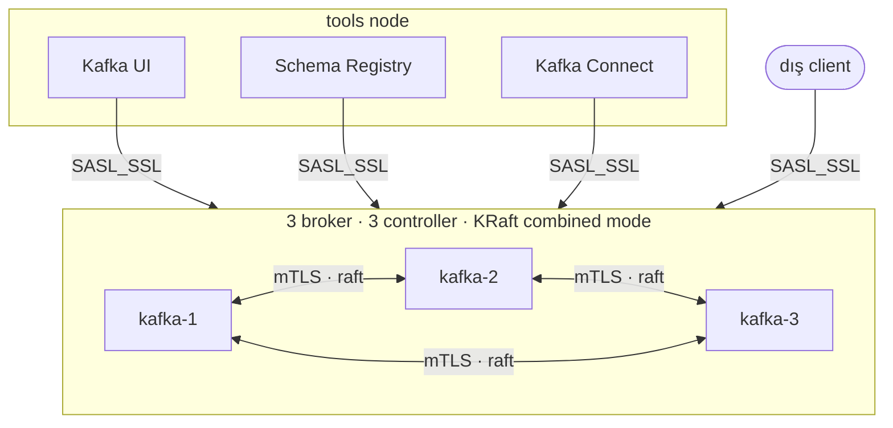

# kafka-kraft-ansible

Ansible ile **3 broker'lı, KRaft modunda Apache Kafka** cluster'ı — TLS,
SASL/SCRAM ve ACL'lerle birlikte; ayrıca Kafka UI, Schema Registry ve Kafka
Connect'i *cluster'ı durdurmadan* eklemeye izin veren bir yapı.

🇬🇧 [English README](README.md) · Bu dosya Türkçe çeviridir; repo'nun ana dili
İngilizce'dir. Ayrıntılı dökümantasyon `docs/` altında ve İngilizce'dir.

Her push'ta sıfırdan 4 node'luk cluster kurulur, operatörün çalıştıracağı
`site.yml` çalıştırılır, iki kez converge edilir ve ikinci geçişte herhangi
bir değişiklik olursa test düşer.



## Neden bu repo?

Çoğu Kafka örneği tek seferlik bir `docker-compose up` gösterir. Buradaki
hedef farklı — ve aşağıdakilerin her biri iddia değil, **ölçüm**:

**Gerçek makinelerde çalışan bir kurulum.** Tarball + systemd, hiçbir şeyin
etrafında container sarmalayıcı yok. Lab container kullanıyor ama sadece VM
yerine geçsin diye: içlerinde gerçek systemd ve sshd çalışıyor, Ansible onlara
SSH ile bağlanıyor. Prod'a geçiş farklı bir inventory dosyasından ibaret.

**Kanıtlanmış modülerlik.** Schema Registry çalışan bir cluster'a eklendi:
5 satır inventory, 2 komut, ve sonrasında broker servis başlangıç zamanları
saniyesi saniyesine aynı. Ayrıntısı: [docs/09-extending.md](docs/09-extending.md).

**Kabul kriteri olarak idempotency.** CI iki kez converge eder ve ikinci
geçişte değişiklik görürse başarısız olur.

**Sadece kurulum değil, işletme.** Sürekli üretim yaparken rolling restart:
7562 mesaj gönderildi, 7562'si onaylandı, 7562'si saklandı. Aktifleştirmeden
önce indiren bir upgrade. Ve güvenlik ağlarının çalıştığını göstermek için
**kasten başarısız olan** bir downgrade.

**Canlı cluster'a uygulanmış güvenlik.** PLAINTEXT'ten SASL_SSL'e üç rolling
geçişte, kesintisiz; ardından varsayılanı reddetmek olan ACL'ler. Kimlik
bilgisiz client reddediliyor; kimlik bilgisi olan ama ACL'i olmayan client da
reddediliyor; UI her şeyi okuyabiliyor, hiçbir şeye yazamıyor.

## Hızlı başlangıç

Gereksinimler: `podman` (veya `docker`), `ansible-core`, `make`.

```bash
make lab-up    # 4 adet systemd + sshd container
make ping      # bağlantı testi
make site      # kurulum
make verify    # uçtan uca doğrulama
```

Kafka UI: <http://localhost:8080> · Broker (host'tan): `localhost:39091-3`

## Dökümantasyon

Tümü İngilizce, `docs/` altında:

| | |
|---|---|
| [Architecture](docs/01-architecture.md) | topoloji, üç listener, dayanıklılık, config nerede durur |
| [Prerequisites](docs/02-prerequisites.md) | kontrol makinesi ve hedeflerin gereksinimleri |
| [Installation](docs/03-installation.md) | lab, sonra gerçek sunucular |
| [Configuration reference](docs/04-configuration-reference.md) | hangi değişken nerede |
| [Operations](docs/05-operations.md) | rolling restart, upgrade, geri alma, sağlık, broker değiştirme |
| [Security](docs/06-security.md) | sertifikalar, hesaplar, ACL'ler ve açma sırası |
| [Monitoring](docs/07-monitoring.md) | ne izlenmeli — ve bu repo neyi henüz içermiyor |
| [Troubleshooting](docs/08-troubleshooting.md) | bu projede karşılaşılan her hata ve gerçek sebebi |
| [Extending](docs/09-extending.md) | çalışan cluster'a bileşen ekleme |
| [Decisions](docs/adr/) | KRaft, tarball, PEM, controller listener, lab |
| [Contributing](CONTRIBUTING.md) | yukarıdakileri mümkün kılan 5 kural |

## Lab ile prod arasındaki tek fark: inventory

```
inventories/lab/hosts.yml    127.0.0.1:2221-2224  (podman)
inventories/prod/hosts.yml   gerçek IP'ler:22     (VM)
```

Profil farkları — heap boyutu ve OS tuning — tek dosyada:
`inventories/*/group_vars/all/profile.yml`. Roller hangi ortamda olduklarını
hiç sormaz.

## Bileşen eklemek

```bash
# 1) inventory'ye grubu ve host'u ekle
# 2) sadece o bileşeni kur
ansible-playbook -i inventories/lab playbooks/site.yml \
  --tags schema_registry --limit schema_registry
# 3) UI'ı haberdar et — broker'lara tek task gitmez
ansible-playbook -i inventories/lab playbooks/site.yml --tags kafka_ui
```

## Dizin yapısı

```
lab/           WSL test ortamı (Containerfile + up/down scriptleri)
inventories/   lab ve prod envanterleri
playbooks/     site, verify, rolling-restart, upgrade, tls, scram-users, acls
roles/         common, java, tls, kafka, kafka_topics, kafka_acls,
               kafka_ui, schema_registry, kafka_connect
molecule/      CI test senaryosu
docs/          mimari, işletme, güvenlik, troubleshooting, kararlar
```

## Lisans

MIT
