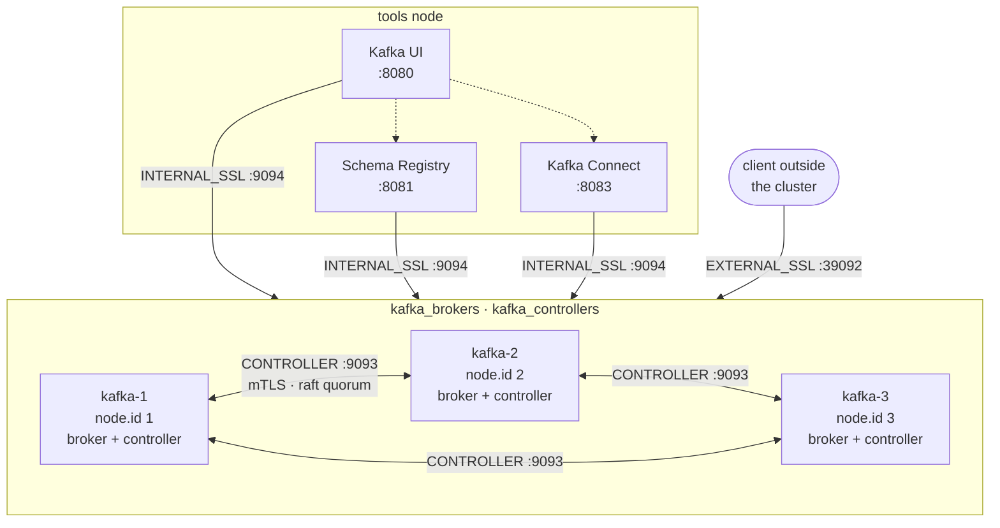

# Architecture

## The cluster



Three nodes, each both broker and controller. That is KRaft's *combined* mode:
the metadata that used to live in ZooKeeper now lives in a Raft log the
controllers maintain among themselves.

A quorum needs a majority, so three controllers tolerate losing one. Five
tolerate losing two. An even number buys nothing, which is why controller
counts are always odd.

The role also supports *isolated* mode — separate controller and broker nodes
— through `kafka_process_roles`. Moving to it is an inventory change: put
different hosts in `kafka_controllers` than in `kafka_brokers`.

## Listeners

One address cannot serve both the cluster and the outside world. A broker
tells clients where to reach it via `advertised.listeners`, and there is no
single answer that works for a peer inside the cluster and a client outside
it. So there are three listeners, each with its own job.

| Listener | Bind | Advertised as | Protocol | Used by |
|---|---|---|---|---|
| `INTERNAL_SSL` | `:9094` | `kafka-N:9094` | SASL_SSL | brokers, UI, Schema Registry, Connect |
| `EXTERNAL_SSL` | `:39092` | `localhost:3909N` | SASL_SSL | clients outside the cluster |
| `CONTROLLER` | `:9093` | not advertised | SSL (mutual) | the Raft quorum |

Kafka refuses a configuration that advertises the controller listener, which
is the mechanism enforcing that quorum traffic stays internal.

In production the same structure holds with different addresses: `INTERNAL`
advertises a private IP, `EXTERNAL` a public one.

### Why the controller listener is different

`controller.quorum.voters` names exactly one endpoint per node:

```
controller.quorum.voters=1@kafka-1:9093,2@kafka-2:9093,3@kafka-3:9093
```

One port means one listener, so the quorum cannot migrate onto a second one
the way client traffic can. It also cannot be left unauthenticated once the
authorizer is on, because quorum traffic would arrive as `User:ANONYMOUS`.
Hence mutual TLS, and hence a protocol change there being a planned outage.
See [ADR 0004](adr/0004-controller-listener-tls.md).

## Durability

```
default.replication.factor = 3
min.insync.replicas        = 2
```

Every partition has three copies, and a write with `acks=all` is acknowledged
once two of them have it.

| Brokers down | Reads | Writes |
|---|---|---|
| 0 | yes | yes |
| 1 | yes | yes |
| 2 | yes | **refused** |

The refusal is the point. The alternative is a cluster that accepts data it
cannot protect and tells nobody. Measured: with one broker stopped, 50 of 50
writes were accepted; with two stopped, 0 of 50.

`auto.create.topics.enable` is false for a related reason: a typo in a client
should not quietly create a single-replica topic. Topics are declared instead
— see [Extending](09-extending.md).

## Components

Everything is a tarball or a jar under systemd. No container runtime is
involved anywhere in the deployment; the lab uses containers only as stand-ins
for VMs.

| Component | Source | Service | Account |
|---|---|---|---|
| Broker + controller | Apache Kafka tarball | `kafka` | `kafka` |
| Kafka Connect | the same tarball | `kafka-connect` | `kafka-connect` |
| Schema Registry | Confluent Community tarball | `schema-registry` | `schema-registry` |
| Kafka UI | kafbat/kafka-ui jar | `kafka-ui` | `kafka-ui` |

Each runs as its own account. A component compromised on a shared host does
not inherit read access to the broker's data directory.

Java versions differ on purpose: Kafka 4.x is supported on 21, Kafka UI 1.5 is
compiled for 25, and both run on the tools node. Each component states the
version it needs and the JVM is resolved from that number rather than from
whichever one `/usr/bin/java` happens to point at.

## Where configuration lives

```
inventories/<env>/
├── hosts.yml                  which machines, which groups
├── host_vars/                 per-node identity (node ids, JDK list)
└── group_vars/all/
    ├── cluster.yml            ports, addresses, derived bootstrap list
    ├── profile.yml            lab vs production differences
    ├── security.yml           listener profiles, migration stages
    ├── cluster_id.yml         the KRaft cluster identity
    ├── topics.yml             cluster-wide topic declarations
    └── vault.yml              SCRAM passwords (encrypted)
```

Roles hold defaults; nothing above is duplicated inside them. Anything two
roles need lives in `group_vars/all/` — the distribution version, the install
path, the cluster id, the SASL mechanism all moved there the moment a second
component needed them.

## The one derived value everything hangs off

```yaml
kafka_bootstrap_servers: >-
  {{ groups['kafka_brokers']
     | map('extract', hostvars, 'kafka_internal_host')
     | map('regex_replace', '$', ':' ~ kafka_client_port | trim)
     | join(',') }}
```

Nobody types a broker address anywhere. Adding a fourth broker is two lines in
`hosts.yml`; the UI, Schema Registry and Connect configurations all change on
the next run without being edited.
